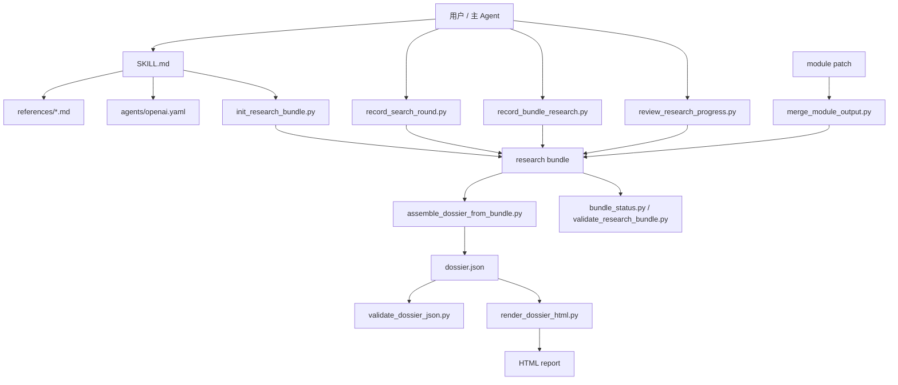

# Equity Investment Dossier

一个面向上市公司的 **深度投资研究 skill / 工作流工具包**。  
它把“研究一家公开交易公司”从一次性对话，变成一个 **todo 驱动、持续复盘、全量落盘、可多 agent 协作** 的本地研究闭环。

最终你得到的不只是几段分析文字，而是一整套可回溯的研究资产：

- `research bundle`
- `dossier.json`
- 多页 HTML 研究报告
- 可解释研究过程的 `research_process`

---

## 这是什么

这个仓库包含一套用于股票研究的 skill 说明、研究规则、bundle schema 和辅助脚本，目标是解决下面这个问题：

> 很多 AI 研究流程只能“当场回答”，但不能把搜索、筛选、提取、复盘、组装的全过程稳定沉淀下来。

`equity-investment-dossier` 的思路是：

1. 先建立本地 `research bundle`
2. 用 todo 驱动研究拆解
3. 每轮搜索先记录 query 与候选结果
4. 拿到有价值的信息后立刻落盘
5. 每轮结束都回看已有证据，再决定下一步
6. 最后从 bundle 组装 dossier 并渲染成报告

---

## 为什么和普通“问 AI”不一样

### 1. 不是一次性回答，而是长期可累积的研究资产

- 搜索 query 会保存
- 候选结果会保存
- review 决策会保存
- 原始文件 / 提取文本 / 笔记 / claims 会保存

### 2. 不是线性写作，而是闭环研究

每轮搜索后都要求：

- 检查已经拿到的东西
- 判断缺口在哪里
- 调整下一轮搜索方向
- 持续更新 todo，直到完成

### 3. 不是只给结论，而是给“研究过程”

这套 skill 会把“为什么最终得出这个判断”体现在结构化 bundle 和最终报告里，而不是只给一个黑盒结论。

---

## 适合谁

适合：

- 想系统研究一家上市公司的个人投资者
- 想把多 agent 研究流程沉淀到本地的人
- 想输出可回看、可验证、可追加的研究报告的人

不太适合：

- 只想快速问几个事实问题
- 只想要一段简短摘要
- 不打算保存研究过程的人

---

## 你会得到什么

### 研究过程资产

- `bundle.json`：研究主状态
- `TODO.md`：主 todo 与 question todo
- `search/`：搜索 query / result / review 快照
- `raw/`：原始文件
- `extracted/`：提取或清洗后的文本
- `working/`：中间工作材料
- `promoted/`：进入高价值层的材料
- `artifacts/`：模块附加产物

### 最终报告资产

- `dossier.json`
- 多页 HTML 研究报告

---

## 核心能力

- **Todo 驱动研究**：不是边搜边乱记，而是围绕 todo 推进
- **全量过程落盘**：query、候选结果、review、source、extraction、note、artifact 都可保存
- **分阶段保存**：`foundation / module / gap_close / assembly`
- **多 agent 协作**：主 agent 维护父级 todo，子 agent 负责模块推进
- **模块化组装**：先沉淀 bundle，再合并模块 patch，再组装 dossier
- **最终渲染交付**：从 bundle 生成 `dossier.json` 和多页 HTML

---

## 工作流概览



---

## 研究 bundle 结构

```text
research-bundle/
├── bundle.json
├── TODO.md
├── search/
│   ├── queries/
│   ├── results/
│   └── reviews/
├── raw/
├── extracted/
├── working/
├── promoted/
├── artifacts/
└── dossier.json
```

这些目录内部会继续按阶段分层：

```text
foundation / module / gap_close / assembly
```

---

## 生命周期

bundle 会维护研究状态：

```text
initialized
  -> research_started
  -> foundation_ready
  -> module_ready
  -> report_ready
```

---

## 快速开始

### 1）初始化 bundle

```bash
python3 scripts/init_research_bundle.py \
  --company "Tesla, Inc." \
  --ticker TSLA \
  --exchange NASDAQ \
  --research-date 2026-04-13
```

查看状态：

```bash
python3 scripts/bundle_status.py \
  --input /tmp/equity-dossiers/tsla/research-bundle
```

> 默认输出目录是 `/tmp/equity-dossiers/<ticker-or-company-slug>/`  
> 如果你不想写到 `/tmp`，请显式传 `--base-dir`

### 2）记录一轮搜索

```bash
python3 scripts/record_search_round.py \
  --bundle /tmp/equity-dossiers/tsla/research-bundle \
  --owner main-agent \
  --module research-foundation \
  --todo-id todo-question-foundation-filings \
  --query "Tesla 2025 annual report 10-k sec" \
  --reason "补齐一级 filing 来源" \
  --result-url https://www.sec.gov/example-10k \
  --result-title "Tesla Annual Report" \
  --result-source-kind filing
```

### 3）把有价值的材料立刻落盘

```bash
python3 scripts/record_bundle_research.py \
  --bundle /tmp/equity-dossiers/tsla/research-bundle \
  --owner financial-quality-agent \
  --module financial-quality \
  --todo-id todo-question-foundation-filings \
  --query-id <query-id> \
  --result-id <result-id> \
  --source-id src-tsla-10k-2025 \
  --source-title "Tesla Annual Report 2025" \
  --source-kind filing \
  --source-url https://www.sec.gov/example-10k \
  --copy-file /tmp/tsla-10k.html \
  --bucket raw \
  --filename src-tsla-10k-2025.html
```

### 4）做 review，决定下一步方向

```bash
python3 scripts/review_research_progress.py \
  --bundle /tmp/equity-dossiers/tsla/research-bundle \
  --owner main-agent \
  --todo-id todo-question-foundation-filings \
  --basis "已拿到 10-K 和 proxy" \
  --findings "基础 filing 已够，下一步补 earnings call 与 IR material" \
  --decision "关闭当前 filing todo，转向 earnings 与 IR" \
  --set-status todo-question-foundation-filings=done \
  --next-action "搜索最近 earnings release" \
  --next-action "搜索 investor day / deck"
```

### 5）组装与渲染最终报告

```bash
python3 scripts/assemble_dossier_from_bundle.py \
  --input /tmp/equity-dossiers/tsla/research-bundle

python3 scripts/validate_dossier_json.py \
  --input /tmp/equity-dossiers/tsla/research-bundle/dossier.json

python3 scripts/render_dossier_html.py \
  --input /tmp/equity-dossiers/tsla/research-bundle/dossier.json
```

---

## 目录说明

```text
.
├── SKILL.md
├── README.md
├── .gitignore
├── agents/
├── references/
└── scripts/
```

### `SKILL.md`

给 agent 的主要执行说明，定义完整研究闭环。

### `references/`

放研究规则、输出 schema、多 agent 契约和行业特化参考。

### `scripts/`

放 bundle 初始化、记录搜索、记录研究材料、review、校验、组装与渲染脚本。

### `agents/`

放面向具体 agent 接口的默认 prompt / 配置。

---

## 关键脚本

| 脚本 | 作用 |
|---|---|
| `init_research_bundle.py` | 初始化 bundle、TODO 与目录结构 |
| `record_search_round.py` | 记录 query 与候选结果 |
| `record_bundle_research.py` | 记录 source / extraction / claim / note / artifact |
| `review_research_progress.py` | 记录 review，并更新 todo 与下一步动作 |
| `merge_module_output.py` | 合并模块产出的结构化 patch |
| `bundle_status.py` | 查看当前阶段、todo、搜索与文件计数 |
| `validate_research_bundle.py` | 校验 bundle 结构与 workflow |
| `assemble_dossier_from_bundle.py` | 从 bundle 组装 dossier |
| `validate_dossier_json.py` | 校验最终 dossier JSON |
| `render_dossier_html.py` | 输出多页 HTML 报告 |

---

## 多 agent 协作方式

### 主 agent

- 初始化 bundle
- 建立与维护父级 todo
- 定期 review 研究进展
- 决定下一轮搜索方向
- 负责最后收敛与组装

### 子 agent

- 负责模块研究
- 负责来源搜集与提取
- 负责模块 patch 输出
- 可以提出候选 question todo

详细约定见：

- `references/multi-agent-contracts.md`

---

## 参考文档

建议最少先读这些：

- `references/source-map.md`
- `references/output-schema.md`
- `references/evidence-rules.md`
- `references/research-bundle-schema.md`
- `references/multi-agent-contracts.md`

如果是行业特化公司，再补读对应的 `sector-*.md`。

---

## 运行要求

- Python 3.9+
- 当前脚本以标准库为主
- 默认产物会写到 `/tmp/equity-dossiers/...`

---

## 当前定位

这个仓库更适合：

- 深度研究流程
- 研究自动化实验
- 多 agent 协作研究
- 把一次性研究升级成可追踪、可迭代的研究系统

它目前不是：

- 实时行情系统
- 券商级数据库
- 交易执行工具

---

## 安全提示

建议不要把下面这些内容直接提交到仓库：

- API keys
- 私有研究材料
- 带隐私信息的日志
- 受版权限制的完整原文材料

运行时目录 `.omx/`、缓存与日志文件也不建议提交，仓库已通过 `.gitignore` 做基础忽略。

---

## 免责声明

本项目用于研究流程组织、信息沉淀和报告生成，不构成任何投资建议。  
请自行核验数据来源、口径、时点与结论。
